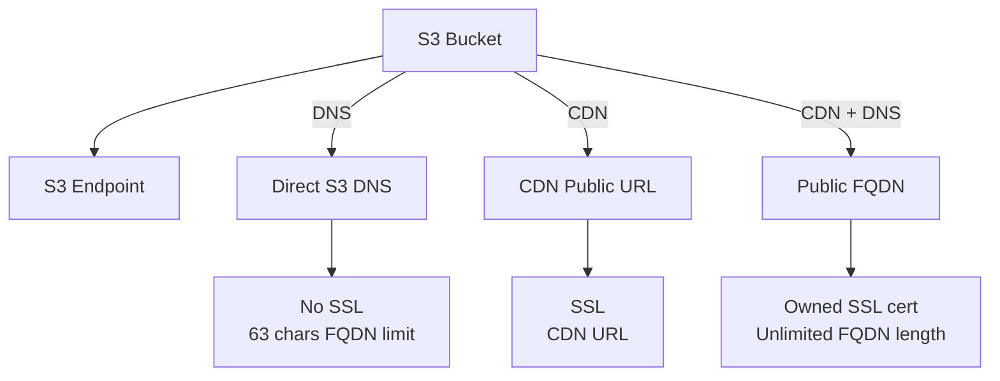

# Deploy static site to AWS (S3+CDN+R53)

GitHub action to deploy anything into a bucket, adding the options to add a CDN and use a Domain (if hosted in Route53) with certificates.

This action will copy the files from the defined folder into an S3 bucket, defining the content type and serving ALL OF THEM PUBLICLY.


## Action main options graph



## Requirements

1. Files to publish
2. An AWS Account
3. If domain and cert wanted, registered domain in AWS.

### 1. Files to publish

Will grab everything defined in `aws_site_source_folder` and push it to a bucket.

Define `aws_site_root_object` if different than `index.html`.

### 2. An AWS account

You'll need [Access Keys](https://docs.aws.amazon.com/powershell/latest/userguide/pstools-appendix-sign-up.html) from an [AWS account](https://aws.amazon.com/premiumsupport/knowledge-center/create-and-activate-aws-account/)

### 3. CERTIFICATES - Only for AWS Managed domains with Route53

If `aws_r53_domain_name` is defined, we will look up for a certificate with the name of that domain (eg. `example.com`). We expect that certificate to contain both `example.com` and `*.example.com`.

Setting `aws_r53_create_root_cert` to `true` will create this certificate with both `example.com` and `*.example.com` for you, and validate them. (DNS validation).

Setting `aws_r53_create_sub_cert` to `true` will create a certificate **just for the subdomain**, and validate it.

> :white_check_mark: If using `aws_r53_create_sub_cert` the total length of the FQDN cannot exceed 64 characters. Use `aws_r53_create_root_cert` or specify one by setting `aws_r53_cert_arn`.

> :warning: Be very careful here! **Created certificates are fully managed by Terraform**. Therefor **they will be destroyed upon stack destruction**.

> :warning: See note about CDN with aliases if using certificates.
>
## Example usage

Create `.github/workflow/deploy.yaml` with the following to build on push.

### Example usage

```yaml
name: Basic deploy
on:
  push:
    branches: [ main ]

jobs:
  Deploy-static-site:
    runs-on: ubuntu-latest

    steps:
    - name: Create deploy-bucket
      uses: bitovi/github-actions-deploy-static-site-to-aws@v0.2.7
      with:
        aws_access_key_id: ${{ secrets.AWS_ACCESS_KEY_ID }}
        aws_secret_access_key: ${{ secrets.AWS_SECRET_ACCESS_KEY }}
        aws_default_region: us-east-1

        tf_action: 'apply'
        tf_state_bucket_destroy: true # If destroying, will remove the bucket
        
        aws_site_cdn_enabled: true
        #aws_site_error_document: error.html # Optional error file
        
        aws_r53_domain_name: example.com # You should own and have this domain available in R53
        aws_r53_sub_domain_name: site
        aws_r53_create_sub_cert: true # Will create and validate a cert for this sub-domain
```

### Advanced example

```yaml
name: Basic deploy
on:
  push:
    branches: [ main ]

jobs:
  deploy-catalog:
    runs-on: ubuntu-latest
    steps:
      - name: Create deploy-bucket
        uses: bitovi/github-actions-deploy-static-site-to-aws@v0.2.7
        with:
          aws_access_key_id: ${{ secrets.AWS_ACCESS_KEY_ID }}
          aws_secret_access_key: ${{ secrets.AWS_SECRET_ACCESS_KEY }}
          aws_default_region: us-east-1

          aws_site_source_folder: packages/catalog/dist
          tf_state_file_name_append: catalog

          tf_action: 'apply'
          tf_state_bucket: 'some-custom-bucket'
          tf_state_bucket_destroy: true

          aws_site_cdn_enabled: true
          aws_site_cdn_custom_error_codes: '[{\"error_caching_min_ttl\":\"0\",\"error_code\":\"403\",\"response_code\":\"200\",\"response_page_path\":\"/index.html\"},{\"error_caching_min_ttl\":\"0\",\"error_code\":\"404\",\"response_code\":\"404\",\"response_page_path\":\"/custom_404.html\"}]'
          aws_site_cdn_response_headers_policy_id: "eaab4381-ed33-4a86-88ca-d9558dc6cd63"

          aws_r53_domain_name: bitovi-sandbox.com
          aws_r53_sub_domain_name: catalog-mfe
          aws_r53_create_sub_cert: true

          aws_site_bucket_name: catalog-mfe

  deploy-marketing:
    runs-on: ubuntu-latest
    steps:
      - name: Create deploy-bucket
        uses: bitovi/github-actions-deploy-static-site-to-aws@v0.2.7
        with:
          aws_access_key_id: ${{ secrets.AWS_ACCESS_KEY_ID }}
          aws_secret_access_key: ${{ secrets.AWS_SECRET_ACCESS_KEY }}
          aws_default_region: us-east-1

          checkout: false
          aws_site_source_folder: packages/marketing/dist
          tf_state_file_name_append: marketing

          tf_action: 'apply'
          tf_state_bucket: 'some-custom-bucket'
          tf_state_bucket_destroy: true

          aws_site_cdn_enabled: true
          aws_site_cdn_custom_error_codes: '[{\"error_caching_min_ttl\":\"0\",\"error_code\":\"403\",\"response_code\":\"200\",\"response_page_path\":\"/index.html\"},{\"error_caching_min_ttl\":\"0\",\"error_code\":\"404\",\"response_code\":\"404\",\"response_page_path\":\"/custom_404.html\"}]'

          aws_r53_domain_name: bitovi-sandbox.com
          aws_r53_sub_domain_name: marketing-mfe
          aws_r53_create_sub_cert: true

          aws_site_bucket_name: marketing-mfe
```

## Customizing

### Inputs

1. [Action defaults](#action-defaults-inputs)
1. [AWS](#aws-inputs)
1. [Terraform options](#terraform-options-inputs)
1. [SITE Settings](#site-settings-inputs)
1. [Certificate](#certificate-inputs)

The following inputs can be used as `step.with` keys
<br/>
<br/>

#### **Action defaults Inputs**

| Name             | Type    | Description                        |
|------------------|---------|------------------------------------|
| `checkout` | Boolean | Set to `false` if the code is already checked out. (Default is `true`). |

<hr/>
<br/>

#### **AWS Inputs**

| Name             | Type    | Description                        |
|------------------|---------|------------------------------------|
| `aws_access_key_id` | String | AWS access key ID |
| `aws_secret_access_key` | String | AWS secret access key |
| `aws_default_region` | String | AWS default region. Defaults to `us-east-1` |
| `aws_role_to_assume` | String | AWS Role to assume. Default is empty. |
| `aws_resource_identifier` | String | Set to override the AWS resource identifier for the deployment. Defaults to `${GITHUB_ORG_NAME}-${GITHUB_REPO_NAME}-${GITHUB_BRANCH_NAME}`. Use with destroy to destroy specific resources. |
| `additional_tags` | JSON | Add additional tags to the terraform [default tags](https://www.hashicorp.com/blog/default-tags-in-the-terraform-aws-provider), any tags put here will be added to all provisioned resources.|

<hr/>
<br/>

#### **Terraform options inputs**

| Name             | Type    | Description                        |
|------------------|---------|------------------------------------|
| `tf_action` | String | Option to run Terraform `apply` / `destroy` action. Will run `plan` if nothing defined. |
| `tf_state_file_name` | String | Change this to be anything you want to. Careful to be consistent here. A missing file could trigger recreation, or stepping over destruction of non-defined objects. Defaults to `tf-state-site`. |
| `tf_state_file_name_append` | String | Appends a string to the tf-state-file. Setting this to `unique` will generate `tf-state-aws-unique`. (Can co-exist with `tf_state_file_name`) |
| `tf_state_bucket` | String | AWS S3 bucket name to use for Terraform state. Defaults to `${org}-${repo}-{branch}-tf-state` |
| `tf_state_bucket_destroy` | Boolean | Force purge and deletion of S3 bucket defined if terraform destroy action succeded. |

<hr/>
<br/>

#### **Site Settings inputs**

| Name             | Type    | Description                        |
|------------------|---------|------------------------------------|
| `aws_site_source_folder` | String | Source folder for files to be published. Will ignore any hidden file. Defaults to root folder of the calling repo if nothing defined. |
| `aws_site_source_include_hidden` | Boolean | Include hidden files in the source folder. Defaults to `false`. |
| `aws_site_root_object` | String | Root object to be served as entry-point. Defaults to `index.html`. |
| `aws_site_error_document` | String | Error document set to S3 website config. Defaults to none. Set value to enable it. |
| `aws_site_bucket_name` | String | AWS S3 bucket name to use for the public files. Defaults to `${org}-${repo}-{branch}-sp`. If using a R53 domain and not a CDN, bucket name will be the FQDN one. See note. |
| `aws_site_cdn_enabled` | Boolean | Enable or disables the use of CDN. Defaults to `false`. |
| `aws_site_cdn_aliases` | String | Extra CNAMEs (alternate domain names), if any, for this distribution. Defaults to defined domain if none passed. (See note). |
| `aws_site_cdn_custom_error_codes` | JSON | Custom error codes to define in CDN. Like `[{\"error_caching_min_ttl\":\"0\",\"error_code\":\"403\",\"response_code\":\"200\",\"response_page_path\":\"/index.html\"}]`. See [this](https://registry.terraform.io/providers/hashicorp/aws/latest/docs/resources/cloudfront_distribution.html#custom-error-response-arguments). |
| `aws_site_cdn_response_headers_policy_id` | String | Comma separated list of response headers policy IDs for CloudFront. Eg. `Managed-CORS-with-preflight-and-SecurityHeadersPolicy` is `eaab4381-ed33-4a86-88ca-d9558dc6cd63`. |
| `aws_site_cdn_min_ttl` | Number | Minimum TTL (in seconds) for CloudFront cache. Default is `0`. |
| `aws_site_cdn_default_ttl` | Number | Default TTL (in seconds) for CloudFront cache. (CloudFront default is `86400` - 24 hours), but defaults to `0` (disabled) |
| `aws_site_cdn_max_ttl` | Number | Maximum TTL (in seconds) for CloudFront cache. (CloudFront default is `31536000` 365 days), but defaults to `0` (disabled). |

<hr/>
<br/>

#### **Certificate Inputs**

| Name             | Type    | Description                        |
|------------------|---------|------------------------------------|
| `aws_r53_domain_name` | String | Define the root domain name for the application. e.g. `bitovi.com`. |
| `aws_r53_sub_domain_name` | String | Define the sub-domain part of the URL. Defaults to `${GITHUB_ORG_NAME}-${GITHUB_REPO_NAME}-${GITHUB_BRANCH_NAME}`. If longer than 63, will use a shorter version. |
| `aws_r53_root_domain_deploy` | Boolean | Deploy application to root domain. Will create root and www records. Default is `false`. |
| `aws_r53_cert_arn` | String | Define the certificate ARN to use for the application. |
| `aws_r53_create_root_cert` | Boolean | Generates and manage the root cert for the application. Default is `false`. |
| `aws_r53_create_sub_cert` | Boolean | Generates and manage the sub-domain certificate for the application. Default is `false`. |

<hr/>
<br/>

## Note about resource identifiers

Most resources will contain the tag `${GITHUB_ORG_NAME}-${GITHUB_REPO_NAME}-${GITHUB_BRANCH_NAME}`, some of them, even the resource name after.
We limit this to a 60 characters string because some AWS resources have a length limit and short it if needed.

We use the kubernetes style for this. For example, kubernetes -> k(# of characters)s -> k8s. And so you might see some compressions are made.

For some specific resources, we have a 32 characters limit. If the identifier length exceeds this number after compression, we remove the middle part and replace it for a hash made up from the string itself.

## Note about bucket names

As a default, the bucket name will be `${GITHUB_ORG_NAME}-${GITHUB_REPO_NAME}-${GITHUB_BRANCH_NAME}-sp`.

But, in the case you add a Route53 domain and no CDN, the bucket name must match the FQDN defined, like `site.example.com`. If setting `aws_r53_root_domain_deploy`, two buckets will be created. `www.{aws_r53_domain_name}`and `{aws_r53_domain_name}`. Traffic from www bucket will be forwarded to the main bucket.
Because of this reason, the length of the FQDN *MUST* be below 64 characters. Will try using the provided FQDN, if none provided, fallback to `resource-identifier.{aws_r53_domain_name}` of the compressed one. IF it still exceeds the limit, will remove as many as needed.

> :warning: HTTPS (TLS / SSL) will only be available if using CDN.

In the case you are using domains and not using a CDN, no cert will be available, and length of the FQDN *MUST* be below 64 characters. Will be adjusted if it exceeds that limit.

## Certificates with CDN

In the case you are using a custom domain name and need to support two alternate domain names, you can use the `aws_site_cdn_aliases`.
If using a certificate, keep in mind that you'll need to specify one that covers the domains being defined.  

For example, if the CDN will support `site.bitovi.com` and `site.bitovi.tools`, the same certificate must cover both *bitovi.com* and *bitovi.tools* domains. (You can use sub-domains too). In that case, you'll need to specify the certificate by defining the `aws_r53_cert_arn`.
If that's the case, `aws_site_cdn_aliases` should be set to: `site.bitovi.com,site.bitovi.tools` (Comma separated, no spaces).

If they alternate domain names are child of the same domain, you can use a root cert for both.

## CloudFront Caching

For deployments or applications that rotate files on each deployment, the default cache TTL settings help ensure a smooth transition between deployments:

- **`aws_site_cdn_default_ttl`**: Set to 24 hours (86400 seconds)
- **`aws_site_cdn_max_ttl`**: Set to 365 days (31536000 seconds)

These settings allow CloudFront to cache files even after they've been deleted from S3, reducing 404 errors during deployment transitions. Files remain cached at edge locations for the specified TTL period, giving users time to gradually transition to the new version.

Example with custom TTL settings:

```yaml
aws_site_cdn_enabled: true
aws_site_cdn_min_ttl: 0
aws_site_cdn_default_ttl: 172800  # 48 hours
aws_site_cdn_max_ttl: 604800      # 7 days
```

## IAM AWS Permissions

Follow the principle of least privilege:

```json
{
  "Version": "2012-10-17",
  "Statement": [
    {
      "Effect": "Allow",
      "Action": [
        "s3:CreateBucket",
        "s3:DeleteBucket",
        "s3:PutObject",
        "s3:GetObject",
        "s3:DeleteObject",
        "s3:ListBucket",
        "s3:PutBucketPolicy",
        "s3:DeleteBucketPolicy",
        "s3:PutBucketWebsite",
        "s3:PutBucketPublicAccessBlock"
      ],
      "Resource": [
        "arn:aws:s3:::${BUCKET_NAME}",
        "arn:aws:s3:::${BUCKET_NAME}/*"
      ]
    },
    {
      "Effect": "Allow",
      "Action": [
        "cloudfront:*"
      ],
      "Resource": "*"
    },
    {
      "Effect": "Allow",
      "Action": [
        "route53:ChangeResourceRecordSets",
        "route53:GetChange",
        "route53:ListResourceRecordSets"
      ],
      "Resource": "arn:aws:route53:::hostedzone/${HOSTED_ZONE_ID}"
    },
    {
      "Effect": "Allow",
      "Action": [
        "acm:RequestCertificate",
        "acm:DescribeCertificate",
        "acm:DeleteCertificate",
        "acm:ListCertificates"
      ],
      "Resource": "*"
    }
  ]
}
```

## Contributing

We would love for you to contribute to [bitovi/github-actions-deploy-static-site-to-aws](https://github.com/bitovi/github-actions-deploy-static-site-to-aws).
Would you like to see additional features?  [Create an issue](https://github.com/bitovi/github-actions-deploy-static-site-to-aws/issues/new) or a [Pull Requests](https://github.com/bitovi/github-actions-deploy-static-site-to-aws/pulls). We love discussing solutions!

## License

The scripts and documentation in this project are released under the [MIT License](https://github.com/bitovi/github-actions-deploy-static-site-to-aws/blob/main/LICENSE).

# Provided by Bitovi

[Bitovi](https://www.bitovi.com/) is a proud supporter of Open Source software.

# We want to hear from you

Come chat with us about open source in our Bitovi community [Discord](https://discord.gg/zAHn4JBVcX)!
