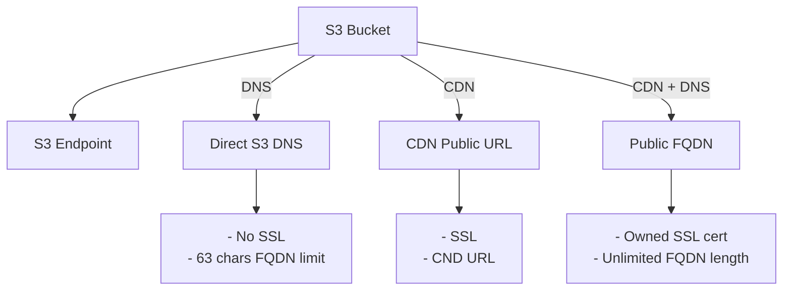

# Deploy static site to AWS (S3+CDN+R53)

GitHub action to deploy anything into a bucket, adding the options to add a CDN and use a Domain (if hosted in Route53) with certificates.

This action will copy the files from the defined folder into an S3 bucket, defining the content type and serving ALL OF THEM PUBLICLY. 

## Action main options graph



## Requirements 

1. Files to publish
2. An AWS Account
3. If domain and cert wanted, registered domain in AWS.

### 1. Files to publish
Will grab everything defined in `aws_spa_source_folder` and push it to a bucket.

Define `aws_spa_root_object` if different than `index.html`.

### 2. An AWS account
You'll need [Access Keys](https://docs.aws.amazon.com/powershell/latest/userguide/pstools-appendix-sign-up.html) from an [AWS account](https://aws.amazon.com/premiumsupport/knowledge-center/create-and-activate-aws-account/)

### 3. CERTIFICATES - Only for AWS Managed domains with Route53
If `aws_r53_domain_name` is defined, we will look up for a certificate with the name of that domain (eg. `example.com`). We expect that certificate to contain both `example.com` and `*.example.com`. 

Setting `aws_r53_create_root_cert` to `true` will create this certificate with both `example.com` and `*.example.com` for you, and validate them. (DNS validation).

Setting `aws_r53_create_sub_cert` to `true` will create a certificate **just for the subdomain**, and validate it.

> :warning: Be very careful here! **Created certificates are fully managed by Terraform**. Therefor **they will be destroyed upon stack destruction**.

## Example usage

Create `.github/workflow/deploy.yaml` with the following to build on push.

### Example usage
```yaml
name: Basic deploy
on:
  push:
    branches: [ main ]

jobs:
  Deploy-SPA:
    runs-on: ubuntu-latest

    steps:
    - name: Create deploy-bucket
      uses: bitovi/github-actions-deploy-static-site-to-aws@v0.1.3
      with:
        aws_access_key_id: ${{ secrets.AWS_ACCESS_KEY_ID_SANDBOX}}
        aws_secret_access_key: ${{ secrets.AWS_SECRET_ACCESS_KEY_SANDBOX}}
        aws_default_region: us-east-1

        tf_action: 'apply'
        tf_state_bucket_destroy: true
        
        aws_spa_cdn_enabled: true
        
        # You should own and have this domain available
        aws_r53_domain_name: example.com
        aws_r53_sub_domain_name: spa
```

## Customizing

### Inputs
1. [Action defaults](#action-defaults-inputs)
1. [AWS](#aws-inputs)
1. [Terraform options](#terraform-options-inputs)
1. [SPA Settings](#spa-settings-inputs)
1. [Certificate](#certificate-inputs)

The following inputs can be used as `step.with` keys
<br/>
<br/>

#### **Action defaults Inputs**
| Name             | Type    | Description                        |
|------------------|---------|------------------------------------|
| `checkout` | Boolean | Set to `false` if the code is already checked out. (Default is `true`). |
<hr/>
<br/>

#### **AWS Inputs**
| Name             | Type    | Description                        |
|------------------|---------|------------------------------------|
| `aws_access_key_id` | String | AWS access key ID |
| `aws_secret_access_key` | String | AWS secret access key |
| `aws_default_region` | String | AWS default region. Defaults to `us-east-1` |
| `aws_role_to_assume` | String | AWS Role to assume. Default is empty. |
| `aws_resource_identifier` | String | Set to override the AWS resource identifier for the deployment. Defaults to `${GITHUB_ORG_NAME}-${GITHUB_REPO_NAME}-${GITHUB_BRANCH_NAME}`. Use with destroy to destroy specific resources. |
| `additional_tags` | JSON | Add additional tags to the terraform [default tags](https://www.hashicorp.com/blog/default-tags-in-the-terraform-aws-provider), any tags put here will be added to all provisioned resources.|
<hr/>
<br/>

#### **Terraform options inputs**
| Name             | Type    | Description                        |
|------------------|---------|------------------------------------|
| `tf_action` | String | Option to run Terraform `apply` / `destroy` action. Will run `plan` if nothing defined. |
| `tf_state_bucket` | String | AWS S3 bucket name to use for Terraform state. Defaults to `${org}-${repo}-{branch}-tf-state` |
| `tf_state_bucket_destroy` | Boolean | Force purge and deletion of S3 bucket defined if terraform destroy action succeded. |
<hr/>
<br/>

#### **SPA Settings inputs**
| Name             | Type    | Description                        |
|------------------|---------|------------------------------------|
| `aws_spa_source_folder` | String | Source folder for files to be published. Will ignore any hidden file. Defaults to root folder of the calling repo if nothing defined. |
| `aws_spa_root_object` | Boolean | Root object to be served as entry-point. Defaults to `index.html`. |
| `aws_spa_website_bucket_name` | String | AWS S3 bucket name to use for the public files. Defaults to `${org}-${repo}-{branch}-sp`. If using a R53 domain and not a CDN, bucket name will be the FQDN one. See note. |
| `aws_spa_cdn_enabled` | Boolean | Enable or disables the use of CDN. Defaults to `false`. |
<hr/>
<br/>

#### **Certificate Inputs**
| Name             | Type    | Description                        |
|------------------|---------|------------------------------------|
| `aws_r53_domain_name` | String | Define the root domain name for the application. e.g. `bitovi.com`. |
| `aws_r53_sub_domain_name` | String | Define the sub-domain part of the URL. Defaults to `${GITHUB_ORG_NAME}-${GITHUB_REPO_NAME}-${GITHUB_BRANCH_NAME}`. |
| `aws_r53_root_domain_deploy` | Boolean | Deploy application to root domain. Will create root and www records. Default is `false`. |
| `aws_r53_cert_arn` | String | Define the certificate ARN to use for the application. |
| `aws_r53_create_root_cert` | Boolean | Generates and manage the root cert for the application. Default is `false`. |
| `aws_r53_create_sub_cert` | Boolean | Generates and manage the sub-domain certificate for the application. Default is `false`. |
<hr/>
<br/>


## Note about resource identifiers

Most resources will contain the tag `${GITHUB_ORG_NAME}-${GITHUB_REPO_NAME}-${GITHUB_BRANCH_NAME}`, some of them, even the resource name after. 
We limit this to a 60 characters string because some AWS resources have a length limit and short it if needed.

We use the kubernetes style for this. For example, kubernetes -> k(# of characters)s -> k8s. And so you might see some compressions are made.

For some specific resources, we have a 32 characters limit. If the identifier length exceeds this number after compression, we remove the middle part and replace it for a hash made up from the string itself. 

## Note about bucket names

As a default, the bucket name will be `${GITHUB_ORG_NAME}-${GITHUB_REPO_NAME}-${GITHUB_BRANCH_NAME}-sp`. 

But, in the case you add a Route53 domain and no CDN, the bucket name must match the FQDN defined, like `spa.example.com`. If setting `aws_r53_root_domain_deploy`, two buckets will be created. `www.{aws_r53_domain_name}`and `{aws_r53_domain_name}`. Traffic from www bucket will be forwarded to the main bucket.
Because of this reason, the length of the FQDN *MUST* be below 64 characters. Will try using the provided FQDN, if not, fallback to `resource-identifier.{aws_r53_domain_name}` of the compressed one. IF it still exceeds the limit, will remove as many as needed.

> :warning: HTTPS (TLS / SSL) will only be available if using CDN.

In the case you are using domains and not using a CDN, no cert will be available, and length of the FQDN *MUST* be below 64 characters. Will be adjusted if it exceeds that limit. 

## Contributing
We would love for you to contribute to [bitovi/github-actions-deploy-static-site-to-aws](https://github.com/bitovi/github-actions-deploy-static-site-to-aws).
Would you like to see additional features?  [Create an issue](https://github.com/bitovi/github-actions-deploy-static-site-to-aws/issues/new) or a [Pull Requests](https://github.com/bitovi/github-actions-deploy-static-site-to-aws/pulls). We love discussing solutions!

## License
The scripts and documentation in this project are released under the [MIT License](https://github.com/bitovi/github-actions-deploy-static-site-to-aws/blob/main/LICENSE).
